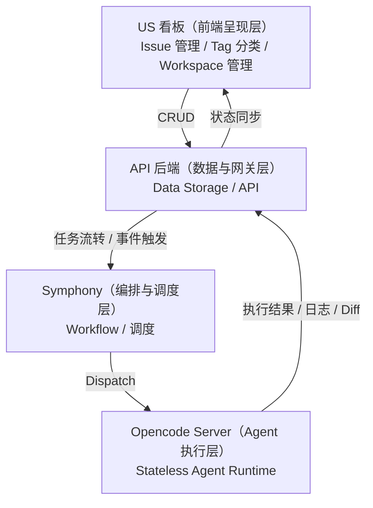

## 1. 产品架构设想

这一版架构强调**职责拆分**：前端看板、API 后端、Symphony 编排、Agent 执行层彼此解耦，降低前端对底层 Agent 状态的感知负担。

### 1.1 结构分层与职责

**US 看板（前端呈现层）**
- 职责：Issue 管理、Tag 分类、工作区管理
- “路径”含义：
  - **Workspace Path**：本地仓库挂载路径（前端开发工具语境）
  - **Router Path**：前端路由路径
- 合理性：路径归前端/工作区管理维护，降低后端耦合。

**API 后端（数据与网关层）**
- 职责：API 接口、核心数据落盘存储（Data Storage）
- 优势：为看板和 Symphony 之间提供**缓冲层**；前端只需 CRUD，不需要理解 Agent 运行状态。

**Symphony（编排与调度层）**
- 职责：自动获取任务、调度执行、管理工作流（workflow / workpad）
- 优势：处理异步任务与资源分配，订阅 API 后端或消息队列，驱动底层 Agent 执行。

**Opencode Server（Agent 执行层）**
- 职责：纯粹的执行者（分析、生成、修复）
- 优势：**无状态（Stateless）**、只负责接单干活、执行后将结果向上汇报。

---

## 2. 架构图（Mermaid）

> 这张图强调了 **前端与 Agent 解耦**：前端看板只关心 Issue 状态和数据，而不直接感知 Agent 的执行细节。所有执行状态与数据统一通过 API 后端落盘并向上同步。
