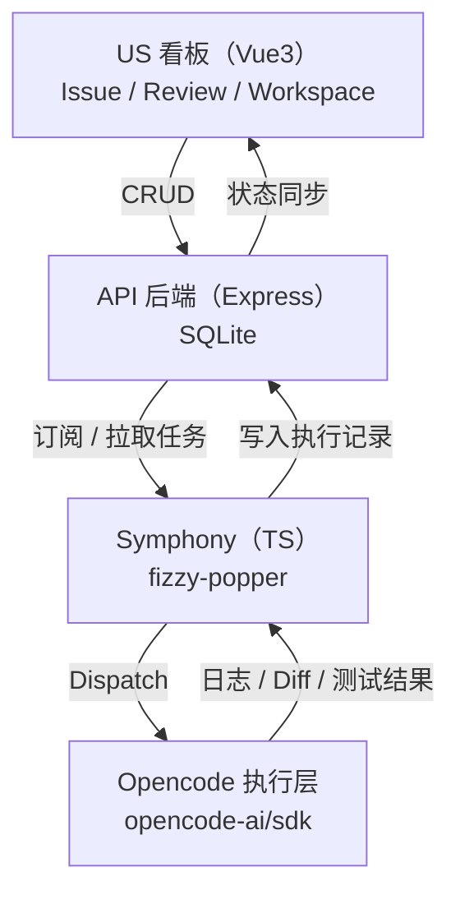

# Symphony Kanban 的四层架构：看板 / API / 编排 / 执行

> 阶段对应：架构设计

本架构以 TypeScript 全栈与多仓拆分为前提，前端使用 Vue3，后端为 Express，数据库采用 SQLite，编排层复用 TypeScript 版 Symphony（基于 `basecamp/fizzy-popper`），执行层通过 `opencode-ai/sdk` 接入。测试统一使用 Vitest。

---

## 1. 架构目标与约束

- 全栈 TypeScript。
- 多仓架构，分层可独立演进与部署。
- 前端只做状态呈现与操作发起，不直接感知 Agent 运行细节。
- API 后端为事实源，所有状态与证据（Proof of Work）统一落盘。
- 编排层可替换且可扩展，执行层保持无状态。

---

## 2. 分层与技术栈映射

**US 看板（前端呈现层）**
- 技术栈：Vue3 + TypeScript + Vite + Vitest
- 职责：Issue 管理、Tag 分类、Workspace 管理、Review 流程、状态与证据展示

**API 后端（数据与网关层）**
- 技术栈：Express + TypeScript + SQLite + Vitest
- 职责：CRUD 与数据聚合、状态事件记录、权限与会话、提供给编排层与前端的统一 API

**Symphony（编排与调度层）**
- 技术栈：TypeScript，复用 `basecamp/fizzy-popper` 作为编排核心
- 职责：任务拉取、状态机推进、调度策略、触发执行、回写结果

**Opencode（执行层）**
- 技术栈：`opencode-ai/sdk`（TypeScript）
- 职责：执行 Agent，产生日志、diff、测试结果与执行摘要

---

## 3. 多仓布局建议（TypeScript 多仓）

建议按层拆分为独立仓库，并在本地以 workspace 或 git 子模块方式统一联调：

1. `symphony-kanban-web`
   - Vue3 应用与 UX 视图
   - 只依赖 API 与共享类型包
2. `symphony-kanban-api`
   - Express 服务与 SQLite 访问层
   - 提供 REST/GraphQL API 与事件流订阅接口
3. `symphony-kanban-symphony`
   - 基于 `basecamp/fizzy-popper` 的编排服务
   - 定时拉取任务、调度执行、回写状态
4. `symphony-kanban-shared`
   - 共享类型与 DTO（Issue、Workflow、Proof of Work）
5. `symphony-kanban-db`
   - SQLite schema、迁移与种子数据

---

## 4. 数据模型（SQLite 核心表）

- `issues`
  - id, title, description, status, priority, workspace_id, created_at, updated_at
- `issue_events`
  - id, issue_id, from_status, to_status, actor, reason, created_at
- `tags`
  - id, name, type, color
- `issue_tags`
  - issue_id, tag_id
- `workspaces`
  - id, name, local_path, context, created_at, updated_at
- `workflow_defs`
  - id, name, definition_json, hooks_json
- `executions`
  - id, issue_id, status, started_at, finished_at, summary
- `execution_artifacts`
  - id, execution_id, type, uri, metadata_json
  - type 示例：log, diff, test, report

说明：
- 大体积日志与 diff 建议落盘到本地文件或对象存储，仅在 SQLite 中存引用 URI 与摘要信息。

---

## 5. 数据流向与状态回路

### 5.1 任务创建与调度

1. 前端创建 Issue → API 写入 `issues` 与 `issue_events`
2. Symphony 轮询或订阅 API → 获取 `Todo` 任务
3. Symphony 通过 `opencode-ai/sdk` 触发执行

### 5.2 执行与证据回写

1. Opencode 执行生成日志、diff、测试结果
2. Symphony 汇总结果 → API 写入 `executions` 与 `execution_artifacts`
3. API 更新 Issue 状态（In Progress → Review / Blocked）

### 5.3 Review 与人工介入

1. 前端 Review 视图读取 `executions` 与 artifacts
2. 人工决策（通过/打回/接管）→ API 记录事件与状态变化

---

## 6. Mermaid 架构图（数据流向）

---

## 7. 测试策略（Vitest）

- 前端：组件渲染、状态流转、API mock
- API：路由与数据持久化（SQLite in-memory）
- Symphony：调度规则与状态机推进
- 共享包：类型校验与序列化一致性

---

## 8. Symphony 复用策略（`basecamp/fizzy-popper`）

- 以 `fizzy-popper` 的 TypeScript 实现作为编排层内核
- 保留其调度与状态推进机制
- 在 Symphony 层封装适配器，提供：
  - API 任务拉取接口
  - `opencode-ai/sdk` 执行器
  - 执行结果回写 API

